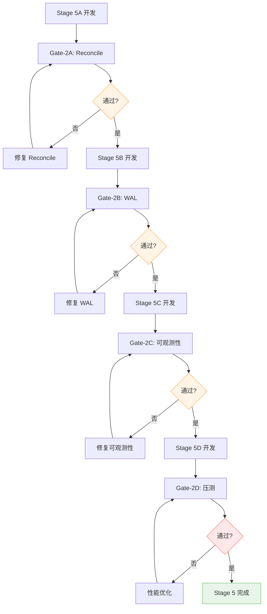

# Stage 5 门禁清单

> **强制执行**：每个 Stage 必须通过专属门禁，否则阻断合并。

---

## 🔴 Gate-2A: Reconcile Query（阶段5A专属）

### 1. Reconcile 稳定性测试（20次重复）

```bash
go test ./pkg/engine -run TestReconcile_QueryOpenOrders -count=20 -timeout 60s
```

**通过标准**：
- 20次全部 PASS
- 无超时（每次 < 3s）
- 无 goroutine 泄漏

---

### 2. Reconcile 全链路时序测试

```bash
go test ./pkg/engine -run TestReconcile_E2E_Timeline -v
```

**通过标准**：
- 断线 → RECONCILING → QueryOpenOrders → GapScan → RUNNING
- 时序确定性（无抖动）
- 状态转换日志完整

---

### 3. Reconcile 超时保护测试

```bash
go test ./pkg/engine -run TestReconcile_Timeout -v
```

**通过标准**：
- 超时后自动降级（RECONCILING → FREEZE）
- 超时时间可配置（默认30秒）

---

## 🟠 Gate-2B: 最小WAL（阶段5B专属）

### 1. WAL 崩溃恢复演练（20次重复）

```bash
go test ./pkg/store -run TestWAL_CrashRecovery -count=20 -timeout 60s
```

**通过标准**：
- 20次全部 PASS
- kill -9 后 INFLIGHT 任务恢复
- WAL 文件完整性校验通过

---

### 2. WAL 回放幂等性测试（20次重复）

```bash
go test ./pkg/engine -run TestWAL_ReplayIdempotent -count=20 -timeout 60s
```

**通过标准**：
- 重复回放不改变最终状态
- 重复回放不产生重复 Task
- WAL 版本号一致性校验通过

---

### 3. WAL 文件大小控制测试

```bash
go test ./pkg/store -run TestWAL_FileSizeLimit -v
```

**通过标准**：
- WAL 文件大小 < 10MB
- 超过上限自动压缩
- 压缩后功能正常

---

## 🟡 Gate-2C: 可观测性（阶段5C专属）

### 1. 日志结构化验证

```bash
go test ./pkg/observability -run TestLogger_StructuredOutput -v
```

**通过标准**：
- 日志格式符合 JSON Lines
- 所有字段可解析
- 无非法字符

---

### 2. 指标采集验证

```bash
go test ./pkg/observability -run TestMetrics_Collection -v
```

**通过标准**：
- 关键指标全部采集：
  - event_backlog
  - task_inflight
  - lease_timeout_count
  - freeze_count
  - ws_health
- 指标值合理（无异常尖刺）

---

### 3. 日志异步性能测试

```bash
go test ./pkg/observability -run TestLogger_AsyncPerformance -v
```

**通过标准**：
- 异步日志不阻塞主循环
- 日志 buffer 可控（< 1000 条）

---

## 🔵 Gate-2D: 压测与长稳（阶段5D专属）

### 1. WS 1000次重连无泄漏

```bash
go test ./pkg/ws -run TestReconnect_Stress -count=1000 -timeout 30m
```

**通过标准**：
- 1000次重连全部成功
- goroutine 数量稳定（< 100）
- 内存占用稳定（< 500MB）

---

### 2. Engine 吞吐上限测试

```bash
go test ./pkg/engine -run TestEngine_Throughput -v
```

**通过标准**：
- 吞吐 > 10000 event/s
- CPU 占用 < 50%
- 无 event 丢失

---

### 3. Engine 积压上限测试

```bash
go test ./pkg/engine -run TestEngine_Backlog -v
```

**通过标准**：
- 积压 1000 events 时不崩溃
- 积压后恢复正常（无永久阻塞）

---

### 4. 24小时长稳测试（可选）

```bash
go test ./pkg/engine -run TestEngine_LongRunning -timeout 24h
```

**通过标准**：
- 24小时运行无 panic
- 24小时运行无 goroutine 泄漏
- 24小时运行无内存泄漏

---

## 门禁执行顺序（Stage 5）



---

## 门禁失败常见问题（Stage 5）

### Q1: Reconcile 超时（> 30s）

**原因**：QueryOpenOrders 请求慢或返回数据量大

**解决**：
```bash
# 增加超时时间（配置项）
ReconcileTimeoutSec: 60

# 或分页查询
go test ./pkg/engine -run TestReconcile_Pagination -v
```

---

### Q2: WAL 文件损坏

**原因**：写入时崩溃导致最后一行不完整

**解决**：
```bash
# 检查 WAL 校验和
go test ./pkg/store -run TestWAL_Checksum -v

# 修复：跳过最后一行损坏记录
WALSkipLastCorruptedLine: true
```

---

### Q3: WS 1000次重连后 goroutine 增长

**原因**：Stop() 方法未正确关闭所有 goroutine

**解决**：
```bash
# 检查 goroutine 泄漏
go test ./pkg/ws -run TestReconnect_GoroutineLeak -v

# 修复：确保 pumpWG.Wait() 在 mainWG.Wait() 之前
```

---

### Q4: Engine 吞吐不达标（< 10000 event/s）

**原因**：reducer 纯函数性能瓶颈

**解决**：
```bash
# Profiling 定位热点
go test ./pkg/engine -run TestEngine_Throughput -cpuprofile=cpu.prof
go tool pprof cpu.prof

# 优化：减少内存分配、使用对象池
```

---

## 门禁豁免流程（仅特殊情况）

**适用场景**：
- 长稳测试（24小时）因 CI 资源限制无法执行
- 压测门禁需要生产环境数据

**申请流程**：
1. 在 PR 中明确说明豁免原因
2. 提供本地测试证据（截图/日志）
3. 需至少 2 位 Reviewer 批准
4. 合并后 14 天内必须补齐门禁

---

## 与 Stage 4 门禁的关系

**继承**：
- Gate-0（本地必过）：编译+单测+静态检查
- Gate-1（CI必过）：Linux Race 检测

**新增**：
- Gate-2A/2B/2C/2D（阶段专属）

**执行顺序**：
1. Gate-0（本地）
2. Gate-2X（阶段专属）
3. Gate-1（CI）
4. Code Review

---

**版本**：v1.0  
**日期**：2025-11-26  
**维护人**：@Qoder
